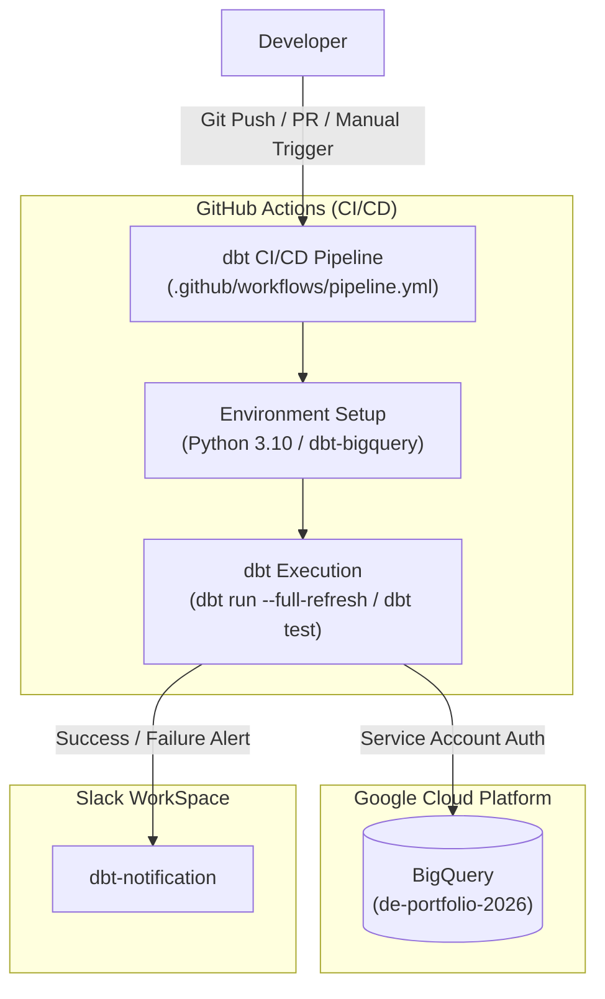

# Data Pipeline Portfolio (dbt + BigQuery + GitHub Actions)

本リポジトリは、Google BigQuery と dbt を用いたデータパイプライン構築、および GitHub Actions による CI/CD 自動化環境のポートフォリオです。

---

## 🏗 システム構成図 (Architecture)

## 🛠 技術スタック (Tech Stack)

| カテゴリ | 採用技術 / ツール | 役割 |
|---|---|---|
| **Data Warehouse** | Google BigQuery | データの格納・変換エンジンの実行環境 |
| **Data Transformation** | dbt (dbt-bigquery 1.12+) | データモデルの定義・ビルド・テスト |
| **CI/CD** | GitHub Actions | パイプラインの自動実行・手動実行（workflow_dispatch） |
| **Notification** | Slack Incoming Webhook | 実行結果（成功 / 失敗）の自動通知 |
| **Language** | SQL / Python 3.10 | データモデル記述および実行環境 |
